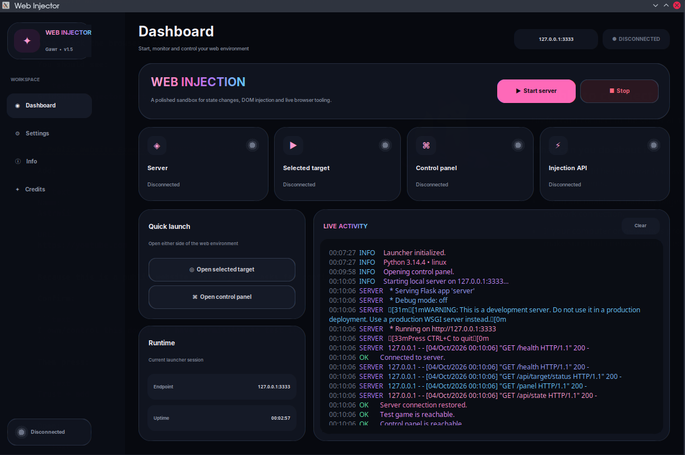
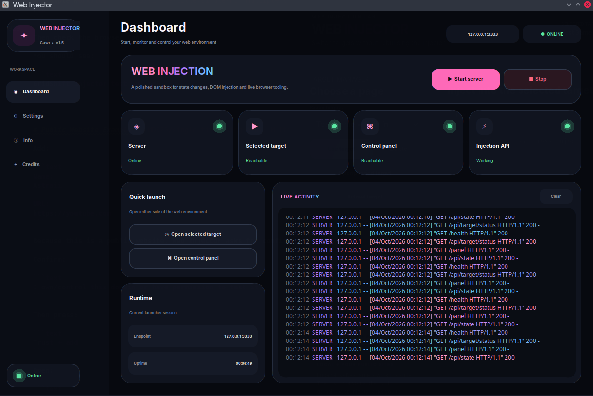
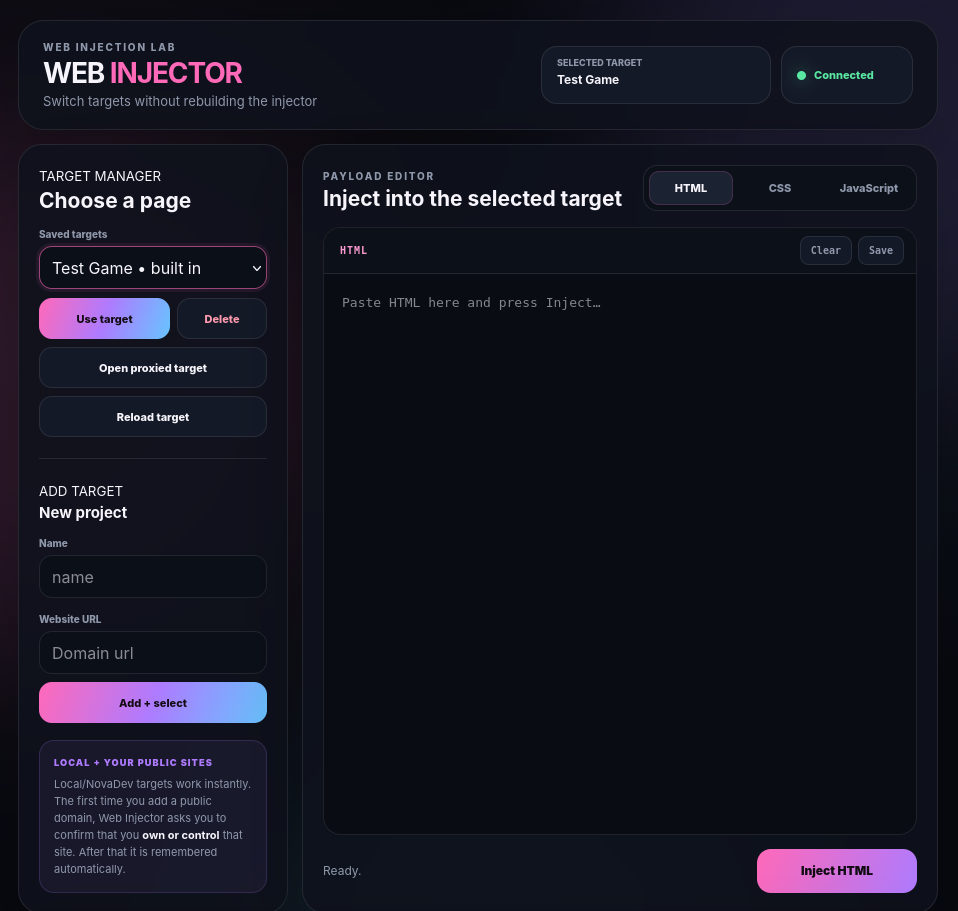

<p align="center">
  
</p>

<p align="center">
  <a href="#setup">
    
  </a>
  <a href="#features">
    
  </a>
  <a href="#targets">
    
  </a>
  <a href="#injection-types">
    
  </a>
  <a href="#api">
    
  </a>
  <a href="#previews">
    
  </a>
  <a href="#security">
    
  </a>
</p>

<p align="center">
  
  
  
  
  
</p>

<p align="center">
  A multi-target web testing and injection tool built with
  <b>Python, Flask, HTML, CSS and JavaScript</b>.
</p>

---

## Web Injector v1.5

Web Injector started as a small local testing project with a built-in Test Game and Control Panel.

Version **1.5** expands the project into a more flexible multi-target testing tool.

It can now load local development websites through its own proxy, inject HTML, CSS and JavaScript into the proxied page, manage multiple targets and support public websites that you own or have permission to test.

---

<a id="features"></a>

## Features

### Target Manager

Version 1.5 introduces a full Target Manager.

You can:

- Add targets
- Remove custom targets
- Switch between targets
- View the selected target
- Check target status
- Open the proxied target
- Reload the target
- Keep the built-in Test Game available at all times

The currently selected website is loaded through:

```text
http://127.0.0.1:5000/target/
```

---

### HTML Injection

Inject HTML directly into the currently loaded proxied page.

Example:

```html
<div style="
    position: fixed;
    top: 20px;
    right: 20px;
    padding: 15px;
    background: #111;
    color: white;
    border-radius: 10px;
    z-index: 999999;
">
    Web Injector Connected
</div>
```

---

### CSS Injection

Inject custom CSS without changing the website's original files.

Example:

```css
body {
    outline: 3px solid #ff4fa3;
}
```

Another example:

```css
* {
    transition: 0.2s ease;
}
```

---

### JavaScript Injection

Run JavaScript inside the proxied target page.

Example:

```js
console.log("Web Injector connected successfully!");
```

Open browser DevTools with:

```text
F12
```

Then open the **Console** tab.

---

### Saved Payloads

Payloads can be saved for later use.

A saved payload contains:

```text
Name
Injection Type
Code
```

Examples:

```text
Console Test
Debug Card
Pink Theme
Page Inspector
GridShift Test
```

Saved payloads are stored locally in the browser.

---

### Starter Payloads

Web Injector also includes starter/example payloads that can quickly be loaded into the editor.

Examples:

```text
HTML Debug Card
CSS Debug Outline
CSS Page Effect
JavaScript Console Test
JavaScript Title Test
```

---

### Target Status

Web Injector can check whether the selected target is reachable.

Possible states include:

```text
Online
Offline
Unavailable
```

This is useful when testing local development servers.

---

### Reload Target

The Control Panel can send a reload event to the target.

This is useful after:

```text
Changing target
Editing a website
Testing a new payload
Resetting page changes
```

---

<a id="setup"></a>

# Setup

## Requirements

Web Injector v1.5 uses:

```txt
Flask>=3.0,<4
customtkinter>=5.2,<6
Pillow>=10,<13
```

These are stored inside:

```text
requirements.txt
```

Other modules used by the project are already included with Python.

Examples:

```text
json
socket
ipaddress
urllib
threading
pathlib
webbrowser
subprocess
```

Node.js is **not required** to run Web Injector.

---

## Linux / Kubuntu

Open a terminal inside the project folder.

Create a virtual environment:

```bash
python3 -m venv .venv
```

Activate it:

```bash
source .venv/bin/activate
```

Install the requirements:

```bash
pip install -r requirements.txt
```

Start Web Injector:

```bash
python3 launcher.py
```

Main pages:

```text
Control Panel:
http://127.0.0.1:5000/panel

Selected Target:
http://127.0.0.1:5000/target/
```

To stop Web Injector:

```text
Ctrl + C
```

---

## Windows

Open **PowerShell** or **Command Prompt** inside the project folder.

Create a virtual environment:

```powershell
py -m venv .venv
```

Activate it in PowerShell:

```powershell
.\.venv\Scripts\Activate.ps1
```

Or activate it in Command Prompt:

```cmd
.venv\Scripts\activate.bat
```

Install the requirements:

```powershell
pip install -r requirements.txt
```

Start Web Injector:

```powershell
py launcher.py
```

Open the Control Panel:

```text
http://127.0.0.1:5000/panel
```

Open the selected target:

```text
http://127.0.0.1:5000/target/
```

To stop Web Injector:

```text
Ctrl + C
```

If PowerShell blocks the activation script:

```powershell
Set-ExecutionPolicy -Scope Process Bypass
```

Then activate the environment again:

```powershell
.\.venv\Scripts\Activate.ps1
```

---

<a id="targets"></a>

# Targets

Web Injector v1.5 supports multiple types of targets.

---

## Built-in Test Game

The original Test Game is still included.

It contains simple game values such as:

```text
Coins
Health
Level
```

The Test Game is useful for testing Web Injector without needing another website.

It is protected inside the Target Manager and cannot be deleted.

---

## Localhost Targets

Local web servers work automatically.

Examples:

```text
http://localhost
http://localhost:3000
http://localhost:8080
http://127.0.0.1
http://127.0.0.1:3000
```

---

## Private LAN Targets

Web Injector can also work with private network addresses.

Examples:

```text
http://192.168.1.50
http://192.168.0.20
http://10.0.0.25
http://172.16.0.10
```

---

## NovaDev / Custom Local Domains

Custom local domains also work.

For example:

```text
http://gridshift.net
```

Even though `.net` normally looks like a public domain, Web Injector checks where the hostname resolves.

If:

```text
gridshift.net
```

points to:

```text
127.0.0.1
```

or another private IP, Web Injector treats it as a local development website.

This means NovaDev projects can use names such as:

```text
http://gridshift.net
http://project.dev
http://website.local
http://game.test
http://myproject.net
```

without needing special code for each domain ending.

---

## Public Websites

Web Injector can also work with public websites that you own or have permission to test.

Example:

```text
https://youtube.com
```

When adding a public website for the first time, Web Injector shows a confirmation.

Example:

```text
PUBLIC DOMAIN

Trust youtube.com?

☐ I own/control this domain or have permission to test it.

[ Cancel ] [ Trust + add ]
```

After approving the domain once, Web Injector remembers it automatically.

You do not have to manually edit the allowlist file.

---

## Trusted Domains

Trusted public domains are stored in:

```text
injector_remote_allowlist.json
```

Example:

```json
{
  "hosts": [
    "youtube.com"
  ]
}
```

This file is created and managed automatically.

---

## Saved Targets

Saved targets are stored in:

```text
injector_targets.json
```

This includes information such as:

```text
Target ID
Target Name
Target URL
Target Type
Currently Selected Target
```

---

<a id="injection-types"></a>

# Injection Types

Web Injector supports three main injection types.

---

## HTML

HTML is added to the currently loaded page.

Example:

```html
<div id="inject-test">
    Hello from Web Injector!
</div>
```

More visible example:

```html
<div style="
    position: fixed;
    top: 20px;
    left: 20px;
    z-index: 999999;
    padding: 14px 18px;
    background: #111522;
    border: 1px solid #ff69b9;
    border-radius: 14px;
    color: white;
">
    Injected successfully
</div>
```

---

## CSS

CSS is inserted into the page using a new `<style>` element.

Example:

```css
body {
    filter: hue-rotate(30deg);
}
```

Debug example:

```css
* {
    outline: 1px solid rgba(255, 0, 255, 0.15);
}
```

---

## JavaScript

JavaScript is executed inside the proxied page.

Basic example:

```js
console.log("Web Injector JavaScript works!");
```

Change the page title:

```js
document.title = "Injected!";
```

Change an element:

```js
const heading = document.querySelector("h1");

if (heading) {
    heading.textContent = "Changed by Web Injector";
}
```

---

# How the Proxy Works

Web Injector does not modify the original website files.

Instead, the selected target is loaded through Web Injector's local proxy.

Example:

```text
Original website:

http://gridshift.net
```

becomes:

```text
Proxied website:

http://127.0.0.1:5000/target/
```

The proxied version is where injections happen.

---

## Important

Do not open the original target URL if you want to see injected content.

Use:

```text
http://127.0.0.1:5000/target/
```

The original files remain unchanged.

---

# Injection Bridge

When Web Injector receives an HTML page from the selected target, it adds its injection bridge.

Example:

```html
<script src="/injector-bridge.js"></script>
```

The bridge checks Web Injector for new events.

The flow looks like this:

```text
Control Panel
     ↓
Web Injector API
     ↓
Target Manager
     ↓
Local Proxy
     ↓
Selected Website
     ↓
Injection Bridge
     ↓
HTML / CSS / JavaScript
```

---

## Injection Flow

When you inject something:

```text
Control Panel
     ↓
POST /api/target/inject
     ↓
Web Injector Server
     ↓
Injection Event
     ↓
Injection Bridge
     ↓
Target Page
```

The bridge then handles the payload depending on the selected type.

---

## HTML Flow

```text
HTML Payload
     ↓
Injection Bridge
     ↓
DOM
     ↓
Visible Page
```

---

## CSS Flow

```text
CSS Payload
     ↓
Injection Bridge
     ↓
<style>
     ↓
Page Styling
```

---

## JavaScript Flow

```text
JavaScript Payload
     ↓
Injection Bridge
     ↓
Page JavaScript Context
     ↓
Executed Code
```

---

# Example Workflow

Start Web Injector:

```bash
python3 launcher.py
```

Open the panel:

```text
http://127.0.0.1:5000/panel
```

Add a target:

```text
Name:
GridShift

URL:
http://gridshift.net
```

Select GridShift.

Open:

```text
http://127.0.0.1:5000/target/
```

Select the JavaScript tab.

Inject:

```js
console.log("GridShift injector test worked!");
```

Open DevTools:

```text
F12
```

Then check the browser Console.

You should see:

```text
GridShift injector test worked!
```

---

# Public Website Example

Add:

```text
Name:
Astraii

URL:
https://youtube.com
```

Because this is a public website, Web Injector asks for confirmation.

Confirm:

```text
I own/control this domain or have permission to test it.
```

Then press:

```text
Trust + add
```

Open:

```text
http://127.0.0.1:5000/target/
```

Then inject:

```js
console.log("Astraii connected to Web Injector");
```

---

# Resetting Changes

Injected HTML, CSS and JavaScript change the currently loaded browser page.

They do not directly modify the original website files.

Refreshing the proxied target usually restores the original page.

You can also use Web Injector's reload/reset controls.

---

# Target Manager

The Target Manager keeps track of:

```text
Target Name
Target URL
Target Type
Target ID
Selected Target
```

Example target list:

```text
Test Game
GridShift
Astraii
My Local Website
```

The built-in Test Game cannot be deleted.

Custom targets can be removed.

---

# Configuration Files

Web Injector may create:

```text
injector_targets.json
injector_remote_allowlist.json
```

These are runtime files.

They do not need to exist before the application starts.

Web Injector creates them when needed.

---

# Folder Structure

```text
Web-Injector/
├── assets/
│   ├── fonts/
│   ├── icons/
│   └── images/
│
├── backend/
│   ├── routes.py
│   ├── state.py
│   └── websocket.py
│
├── src/
│   ├── game/
│   │   ├── index.html
│   │   ├── game.css
│   │   └── game.js
│   │
│   └── panel/
│       ├── index.html
│       ├── panel.css
│       └── panel.js
│
├── launcher.py
├── server.py
├── requirements.txt
├── injector_targets.json
├── injector_remote_allowlist.json
└── README.md
```

---

<a id="api"></a>

# API

Web Injector v1.5 contains API routes for target management and injection.

---

## Target Routes

```text
GET    /api/targets
POST   /api/targets/select
POST   /api/targets/add
DELETE /api/targets/<target_id>
```

---

## Target Runtime Routes

```text
GET  /api/target/status
GET  /api/target/revision
GET  /api/target/pending
```

---

## Injection Routes

```text
POST /api/target/inject
POST /api/target/reset
```

---

## Proxy Routes

```text
/target/
/target/<path>
```

---

## Bridge Route

```text
/injector-bridge.js
```

---

# Live Updates

The original Test Game backend uses lightweight browser communication for its state updates.

The existing file:

```text
backend/websocket.py
```

remains part of the project structure.

Version 1.5's target injection system uses lightweight polling between the target bridge and Web Injector.

This allows events such as:

```text
HTML Injection
CSS Injection
JavaScript Injection
Reload
Reset
```

to be delivered to the currently loaded target page.

---

# Test Payloads

## Console Test

```js
console.log("Web Injector test successful!");
```

---

## Alert Test

```js
alert("Web Injector connected!");
```

---

## Page Title Test

```js
document.title = "Web Injector Test";
```

---

## HTML Card Test

```html
<div style="
    position: fixed;
    bottom: 20px;
    right: 20px;
    padding: 16px 20px;
    background: #13131a;
    color: white;
    border: 1px solid #ff4fa3;
    border-radius: 12px;
    z-index: 999999;
">
    Web Injector v1.5
</div>
```

---

## CSS Glow Test

```css
body {
    box-shadow: inset 0 0 100px rgba(255, 79, 163, 0.25);
}
```

---

# Troubleshooting

## Target does not load

Check that the original website works first.

For local projects, make sure their server is running.

Example:

```text
http://gridshift.net
```

should work normally before trying:

```text
http://127.0.0.1:5000/target/
```

---

## Injection does not appear

Make sure you are viewing:

```text
http://127.0.0.1:5000/target/
```

and not the original website directly.

---

## JavaScript output is not visible

Open DevTools:

```text
F12
```

Then open:

```text
Console
```

---

## Public website asks for trust

This is expected.

Confirm that you own/control the website or have permission to test it.

Once trusted, Web Injector remembers the domain.

---

## PowerShell blocks virtual environment activation

Run:

```powershell
Set-ExecutionPolicy -Scope Process Bypass
```

Then:

```powershell
.\.venv\Scripts\Activate.ps1
```

---

<a id="previews"></a>

# Previews

<p align="center">
  
  
</p>

<p align="center">
  
</p>

<a id="security"></a>

# Security

Web Injector is intended for development, learning and testing.

Use it with:

- Your own websites
- Local development websites
- Private development servers
- Test environments
- Staging environments
- Websites you have permission to test

Local targets are accepted automatically.

Public targets require a one-time confirmation before they are stored as trusted.

---

# Notes About Public Websites

Public websites can be more complicated than local websites.

Some websites may use:

```text
HTTPS
Cookies
Login sessions
Content Security Policy
Redirects
Absolute URLs
External APIs
Separate asset domains
WebSockets
```

Because Web Injector loads websites through a local proxy, some complex websites may require additional proxy compatibility work.

Simple websites and development projects should generally be easier to test.

---

# GitHub

Recommended `.gitignore`:

```gitignore
.venv/
__pycache__/
*.pyc

injector_targets.json
injector_remote_allowlist.json
```

Optional example configuration files:

```text
injector_targets.example.json
injector_remote_allowlist.example.json
```

---

# Version History

## v1.5

Added:

```text
Target Manager
Multi-target support
Local proxy system
Custom local targets
NovaDev domain support
Private LAN targets
Public owned targets
Trust Once system
Trusted-domain storage
HTML injection
CSS injection
JavaScript injection
Saved payloads
Starter payloads
Target status
Target reload
Target reset
Improved Control Panel
Linux support
Windows support
```

---

# Version

```text
Web Injector v1.5
```

Built with:

```text
Python
Flask
CustomTkinter
HTML
CSS
JavaScript
```

---

# Disclaimer

Web Injector is intended for development, learning and authorized testing.

Only use it with websites and systems that you own or have permission to test.
